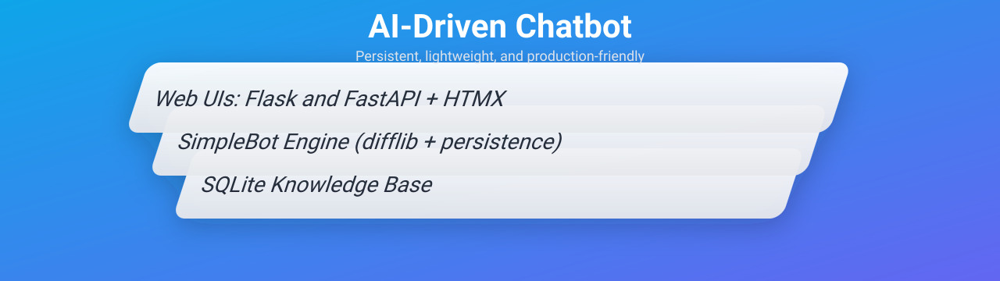
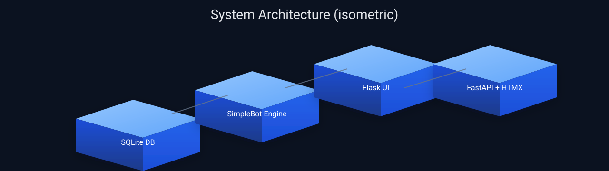

<p align="center">
  
</p>

<p align="center">
  <a href="https://github.com/swoet/AI-Driven-Chatbot-Python-ChatterBot-/actions"></a>
  
  
</p>

# AI-Driven Chatbot (Python)

A lightweight, persistent chatbot with:
- SQLite storage (no data loss across runs)
- A simple CLI
- Two web UIs: Flask and FastAPI + HTMX

---

## Architecture (3D)



---

## Quick start

1) Create a virtual environment (recommended)

```bash
python -m venv .venv
# PowerShell
.\\.venv\\Scripts\\Activate.ps1
# or CMD
.\\.venv\\Scripts\\activate.bat
```

2) Install dependencies

```bash
pip install -r requirements.txt
```

3) Run the CLI

```bash
python chatbot.py
```

4) Run the Flask web UI

```bash
python webapp/app.py
# open http://127.0.0.1:8000
```

5) Run the FastAPI + HTMX UI

```bash
python -m uvicorn fastapi_app.main:app --reload
# open http://127.0.0.1:8000
```

The first run creates `database.sqlite3`. CLI and both UIs share the same knowledge base.

## Configuration

- `CHATBOT_DB_PATH` – Path to the SQLite database file (default: `./database.sqlite3`).
- `CHATBOT_READ_ONLY` – If `true`, disables training (default: `false`).

Example (PowerShell):

```powershell
$env:CHATBOT_DB_PATH = "C:\\path\\to\\mydb.sqlite3"
$env:CHATBOT_READ_ONLY = "true"
```

## UI/UX

- Clean web UIs (Flask or FastAPI + HTMX)
- Per-session conversation history (Flask) and HTMX incremental updates (FastAPI)
- Clear chat and reset training (delete DB)
- Teach-a-pair panel to add Q/A training examples on the fly

## Project structure

- `chatbot.py` – CLI entrypoint
- `bot_core.py` – Bot engine (SQLite + difflib) and bootstrap training
- `webapp/app.py` – Flask web UI
- `webapp/templates/` and `webapp/static/` – UI templates and styles
- `fastapi_app/main.py` – FastAPI + HTMX web UI
- `fastapi_app/templates/` and `fastapi_app/static/` – UI templates and styles
- `tests/` – Unit tests
- `.github/workflows/tests.yml` – CI for tests

## Roadmap

- Corpus-based training flows
- Export/import knowledge base snapshots
- Linting (ruff), type checking, and pre-commit hooks
- Docker for the FastAPI variant
- Optional Streamlit UI (re-add `streamlit` when platform provides prebuilt `pyarrow`)
